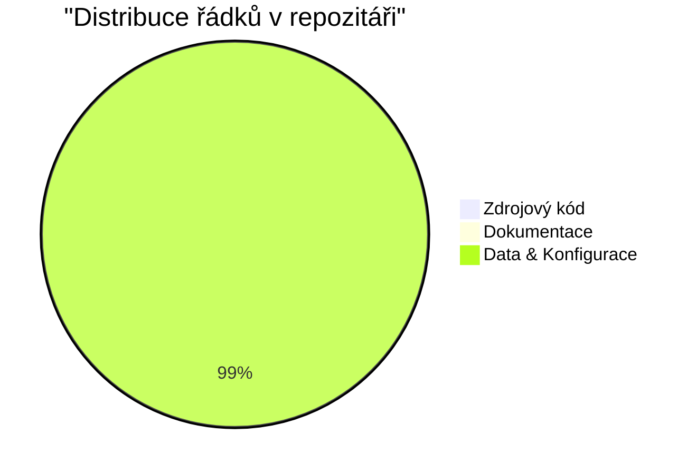

# 📊 Repository Analytics & Compliance Report

*Poslední aktualizace: **20.05.2026 v 13:21:57***

> [!IMPORTANT]
> ### 🎓 Týdenní Hodnocení & Disciplína (Grading Dashboard)
> Tato sekce vyhodnocuje plnění administrativních podmínek pro získání bonusu **60 bodů** do vašeho Týdenního Indexu.
> 
> - **Podmínka 1: Min. 3 commity za týden**
>   - *Stav:* ❌ **1/3** - Nesplněno (Cíl: min 3, aktuálně 1)
> - **Podmínka 2: Pravidlo 12 hodin rozestupu**
>   - *Stav:* ❌ - Nesplněno (Není nalezen 12hodinový rozestup mezi 3 commity)
> - **Podmínka 3: Dokumentace README.md a [nazev]_projekt.md**
>   - *Stav:* ✅ - Splněno (Dokumentováno 8 z 8 projektů)
> 
> **Odhadovaný týdenní bonus za disciplínu:** `🏆 20 / 60 bodů`
> *Poznámka: Pro přičtení bonusu je nutné získat minimálně 6 bodů za kvalitu kódu od AI (pravidlo 30%).*

## 📈 Celkový přehled repozitáře

| Metrika | Hodnota | Popis |
| :--- | :--- | :--- |
| **Počet projektů** | `8` | Celkový počet evidovaných projektů |
| **Počet adresářů** | `14` | Celkový počet složek (mimo skryté) |
| **Velikost repozitáře** | `22037.29 KB` (~`21.52 MB`) | Celková fyzická velikost souborů |
| **Celkem řádků kódu** | `3377` | Celkový počet řádků ve zdrojových kódech (.py, .cpp, .h) |
| **Celkem řádků dokumentace** | `707` | Celkový počet řádků v dokumentaci (.md) |
| **Celkem datových řádků** | `552571` | Řádky v konfiguracích a datových souborech (.json, .txt, etc) |
| **Průměrně řádků na soubor** | `15904.4` | Průměrná délka analyzovaného souboru |

## 🐙 Git Aktivita & Historie

| Metrika | Hodnota | Popis |
| :--- | :--- | :--- |
| **Celkový počet commitů** | `54` | Celkový počet verzí v historii |
| **Počet aktivních dnů** | `34` | Počet dní s alespoň jedním commitem |
| **Poslední commit (Autor)** | `Paprikon34` | Kdo provedl poslední změnu |
| **Poslední commit (Zpráva)** | `Enhance repo analytics with data files and report` | Popis poslední úpravy |
| **Poslední commit (Datum)** | `2026-05-19T10:02:41+02:00` | Čas poslední úpravy |

## 🗂️ Distribuce přípon souborů

| Přípona | Počet souborů | Podíl z celku |
| :--- | :---: | :---: |
| **.md** | 12 | 34.3% |
| **.py** | 7 | 20.0% |
| **.cpp** | 7 | 20.0% |
| **.json** | 4 | 11.4% |
| **.h** | 3 | 8.6% |
| **.txt** | 2 | 5.7% |

### 📊 Poměr řádků v repozitáři

## 🏆 5 Největších souborů (podle řádků)

| # | Název souboru | Projekt | Počet řádků |
| :--- | :--- | :--- | :---: |
| 1 | `pokemon.json` | 03_poke_lib | 552173 |
| 2 | `pokedex_gui.py` | 03_poke_lib | 833 |
| 3 | `fetch_pokedata.py` | 03_poke_lib | 452 |
| 4 | `update_stats.py` | 08_repo_analytics | 421 |
| 5 | `main.py` | 01_kamen_nuzky_papir | 379 |

## 📁 Detailní přehled jednotlivých projektů

| ID / Složka | Soubory | Kód (řádky) | Dokumentace | Data (řádky) | Stav Dokumentace |
| :--- | :---: | :---: | :---: | :---: | :---: |
| **01_kamen_nuzky_papir** | 2 | 379 | 124 | 0 | ✅ Odevzdána |
| **02_web_scraper_ai** | 3 | 288 | 72 | 4 | ✅ Odevzdána |
| **03_poke_lib** | 6 | 1428 | 95 | 552173 | ✅ Odevzdána |
| **04_banking_simulator** | 2 | 127 | 33 | 0 | ✅ Odevzdána |
| **05_maze_generator** | 2 | 87 | 25 | 0 | ✅ Odevzdána |
| **06_prevod_znaku_ascii** | 2 | 46 | 42 | 0 | ✅ Odevzdána |
| **07_library_management_system** | 10 | 601 | 52 | 271 | ✅ Odevzdána |
| **08_repo_analytics** | 4 | 421 | 102 | 115 | ✅ Odevzdána |
