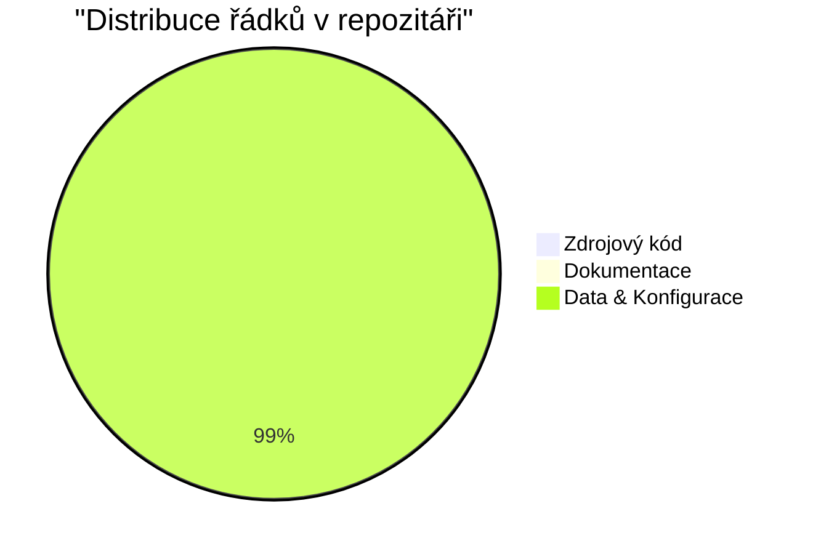
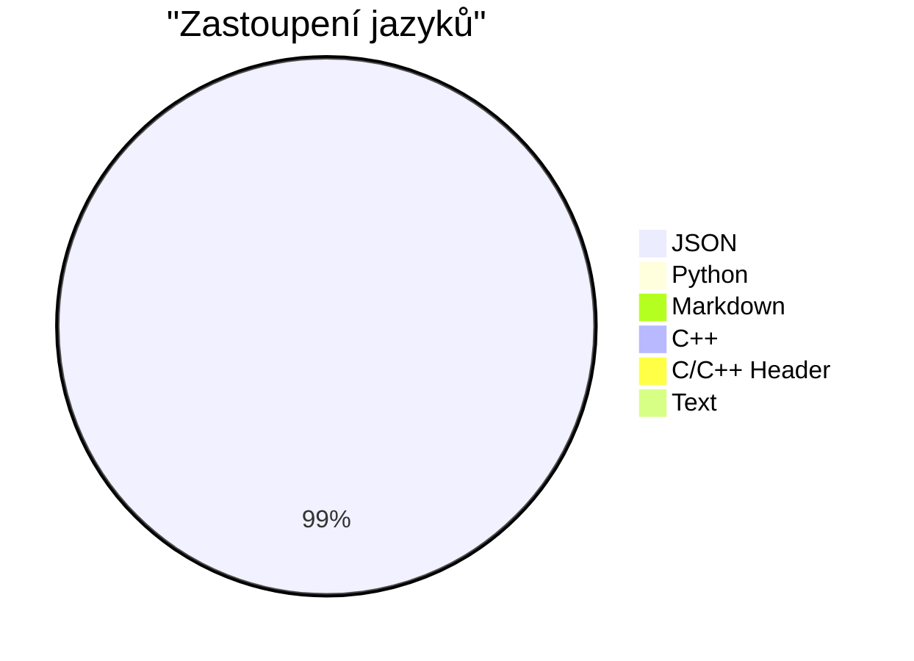

# 📊 Repository Analytics & Compliance Report

*Poslední aktualizace: **02.06.2026 v 10:52:37***

> [!IMPORTANT]
> ### 🎓 Týdenní Hodnocení & Disciplína (Grading Dashboard)
> Tato sekce vyhodnocuje plnění administrativních podmínek pro získání bonusu **60 bodů** do vašeho Týdenního Indexu.
> 
> - **Podmínka 1: Min. 3 commity za týden**
>   - *Stav:* ❌ **0/3** - Nesplněno (Cíl: min 3, aktuálně 0)
> - **Podmínka 2: Pravidlo 12 hodin rozestupu**
>   - *Stav:* ❌ - Nesplněno (Není nalezen 12hodinový rozestup mezi 3 commity)
> - **Podmínka 3: Dokumentace README.md a [nazev]_projekt.md**
>   - *Stav:* ✅ - Splněno (Dokumentováno 8 z 8 projektů)
> 
> **Odhadovaný týdenní bonus za disciplínu:** `🏆 20 / 60 bodů`
> *Poznámka: Pro přičtení bonusu je nutné získat minimálně 6 bodů za kvalitu kódu od AI (pravidlo 30%).*

## 📈 Celkový přehled repozitáře

| Metrika | Hodnota | Popis |
| :--- | :--- | :--- |
| **Počet projektů** | `8` | Celkový počet evidovaných projektů |
| **Počet adresářů** | `14` | Celkový počet složek (mimo skryté) |
| **Velikost repozitáře** | `22048.17 KB` (~`21.53 MB`) | Celková fyzická velikost souborů |
| **Celkem řádků kódu** | `3469` | Celkový počet řádků ve zdrojových kódech (.py, .cpp, .h) |
| **Celkem řádků dokumentace** | `773` | Celkový počet řádků v dokumentaci (.md) |
| **Celkem datových řádků** | `552661` | Řádky v konfiguracích a datových souborech (.json, .txt, etc) |
| **Průměrně řádků na soubor** | `15911.5` | Průměrná délka všech souborů (včetně dat) |
| **Průměrně kód/dok na soubor** | `146.3` | Průměrná délka bez datových souborů |

## 🐙 Git Aktivita & Historie

| Metrika | Hodnota | Popis |
| :--- | :--- | :--- |
| **Celkový počet commitů** | `65` | Celkový počet verzí v historii |
| **Počet aktivních dnů** | `40` | Počet dní s alespoň jedním commitem |
| **Poslední commit (Autor)** | `Repo Bot` | Kdo provedl poslední změnu |
| **Poslední commit (Zpráva)** | `Aktualizována analytika repozitáře (automatickĂ˝ report)` | Popis poslední úpravy |
| **Poslední commit (Datum)** | `2026-06-01T04:20:45+00:00` | Čas poslední úpravy |

## 📝 Statistiky jazyků (podle řádků)

| Jazyk | Počet řádků | Podíl z celku |
| :--- | :---: | :---: |
| **JSON** | 552649 | 99.2% |
| **Python** | 2620 | 0.5% |
| **Markdown** | 773 | 0.1% |
| **C++** | 717 | 0.1% |
| **C/C++ Header** | 132 | 0.0% |
| **Text** | 12 | 0.0% |

## 🗂️ Distribuce přípon souborů

| Přípona | Počet souborů | Podíl z celku |
| :--- | :---: | :---: |
| **.md** | 12 | 34.3% |
| **.py** | 7 | 20.0% |
| **.cpp** | 7 | 20.0% |
| **.json** | 4 | 11.4% |
| **.h** | 3 | 8.6% |
| **.txt** | 2 | 5.7% |

### 📊 Poměr řádků v repozitáři

### 📊 Podíl jednotlivých jazyků

## 🏆 5 Největších souborů (podle řádků)

| # | Název souboru | Projekt | Počet řádků | Velikost |
| :--- | :--- | :--- | :---: | :---: |
| 1 | `pokemon.json` | 03_poke_lib | 552173 | `12067.89 KB` |
| 2 | `pokedex_gui.py` | 03_poke_lib | 833 | `34.69 KB` |
| 3 | `update_stats.py` | 08_repo_analytics | 513 | `23.87 KB` |
| 4 | `fetch_pokedata.py` | 03_poke_lib | 452 | `17.71 KB` |
| 5 | `main.py` | 01_kamen_nuzky_papir | 379 | `17.89 KB` |

## 🕒 5 Naposledy upravených souborů

| # | Název souboru | Projekt | Datum úpravy | Velikost |
| :--- | :--- | :--- | :---: | :---: |
| 1 | `08_repo_analytics_projekt.md` | 08_repo_analytics | 02.06.2026 10:52 | `3.28 KB` |
| 2 | `README.md` | root | 02.06.2026 10:52 | `4.58 KB` |
| 3 | `repo_report.md` | 08_repo_analytics | 02.06.2026 10:52 | `5.02 KB` |
| 4 | `repo_stats.json` | 08_repo_analytics | 02.06.2026 10:52 | `5.59 KB` |
| 5 | `update_stats.py` | 08_repo_analytics | 02.06.2026 10:52 | `23.87 KB` |

## 📁 Detailní přehled jednotlivých projektů

| ID / Složka | Soubory | Kód (řádky) | Dokumentace | Data (řádky) | Velikost | Stav Dokumentace |
| :--- | :---: | :---: | :---: | :---: | :---: | :---: |
| **01_kamen_nuzky_papir** | 2 | 379 | 124 | 0 | `24.40 KB` | ✅ Odevzdána |
| **02_web_scraper_ai** | 3 | 288 | 72 | 4 | `15.73 KB` | ✅ Odevzdána |
| **03_poke_lib** | 6 | 1428 | 95 | 552173 | `12128.98 KB` | ✅ Odevzdána |
| **04_banking_simulator** | 2 | 127 | 33 | 0 | `6.73 KB` | ✅ Odevzdána |
| **05_maze_generator** | 2 | 87 | 25 | 0 | `5.38 KB` | ✅ Odevzdána |
| **06_prevod_znaku_ascii** | 2 | 46 | 42 | 0 | `3.00 KB` | ✅ Odevzdána |
| **07_library_management_system** | 10 | 601 | 52 | 271 | `25.79 KB` | ✅ Odevzdána |
| **08_repo_analytics** | 4 | 513 | 168 | 205 | `37.75 KB` | ✅ Odevzdána |
